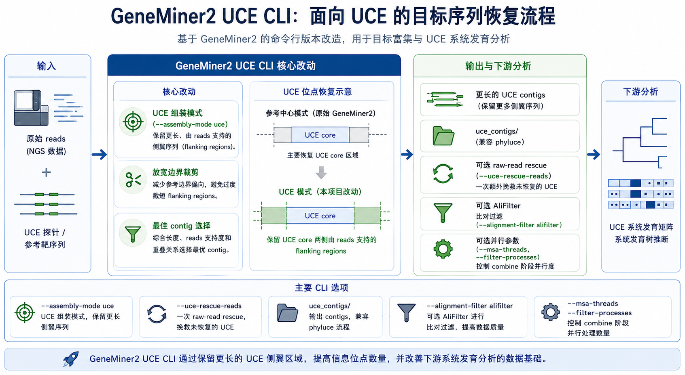

# GeneMiner2-UCE

**[English README](README_EN.md)**

GeneMiner2-UCE 是面向 target-enrichment 和 UCE 数据流程的 GeneMiner2 命令行分支。仓库已经移除 GUI 工程、图形界面说明、截图和内置演示数据，只保留 CLI 源码、构建文件和命令行文档。

本分支不作为可直接 `pip install` 运行的 Python 包发布。请先用 `make` 构建独立命令行程序，然后运行 `cli/geneminer2`。每次 `git pull` 更新源码后都需要重新运行 `make`，否则生成好的可执行文件可能仍然是旧代码。

## 引用与联系

使用当前版本时必须引用 [GeneMiner2-UCE GitHub 仓库](https://github.com/GUIBA-EX/GeneMiner2-UCE)。介绍 GeneMiner2-UCE 的预印本正在准备中，发布后将在此补充。如需修改代码，请联系 [xf@g.ecc.u-tokyo.ac.jp](mailto:xf@g.ecc.u-tokyo.ac.jp)。

## 主要功能

- 基于参考序列从二代测序 reads 中恢复目标分子标记。
- 通过 `--assembly-mode uce` 启用 UCE 组装模式，优先保留更长且有 reads 支持的侧翼 contig。
- 通过 `--uce-rescue-reads` 启用一轮 UCE raw-read rescue。
- 在 `uce_contigs/` 下导出 phyluce 兼容的 UCE contig 文件。
- 通过 `stats` 子命令生成类似 HybPiper 的 UCE 统计表。
- 通过 `--alignment-filter alifilter` 支持可选 AliFilter 比对列过滤。
- 通过 `--msa-threads` 和 `--filter-processes` 控制 combine 阶段并行。



## 本分支改动说明

本分支保留 GeneMiner2 原有的参考引导 reads 捕获和组装框架，但针对 UCE 数据做了命令行流程调整。UCE 探针或 bait 通常较短，而系统发育分析中有用的信息往往来自探针两侧的 flanking region，因此本分支的目标是尽量保留有 reads 支持的侧翼延伸，同时避免接受明显异常的过长 contig。

### 只保留命令行结构

本仓库已经移除 GUI 工程、截图、内置 demo 数据和历史大文件。当前项目定位是小型源码仓库加 `Makefile` 构建流程。仓库不再提供 Python `console_scripts` entry point，也不再保留 `pyproject.toml`；实际运行入口是构建后生成的 `cli/geneminer2`。

### Rust re-filter 实现

二次 reads 过滤现在增加了 Rust 实现，位于 `rust/main_refilter_new/`。它的目标是作为 `scripts/main_refilter_new.py` 的 drop-in replacement：命令行参数和输出目录结构保持兼容，包括 UCE 流程中使用的 `--keep-linked-mates`。

Python 版本仍然保留在 `scripts/main_refilter_new.py`，作为可读的参考实现和 fallback。运行 `make` 时，如果环境中有 `cargo`，会优先构建 Rust binary；如果没有 Cargo，则自动回退到用 PyInstaller 打包 Python 版本。

### UCE 组装模式

`--assembly-mode uce` 会让 GeneMiner2-UCE 在组装时更少受短参考或探针边界限制，优先选择更长且仍有 reads 支持的候选 contig。使用 UCE 模式且不显式指定子命令时，默认流程会跳过基于参考序列的 `trim` 步骤，避免刚组装出的侧翼序列又被裁回探针区域。如果仍然需要参考切齐，可以显式加入 `trim` 子命令。

推荐的 UCE 组装参数是：

```bash
--assembly-mode uce \
-sb unlimited \
-ka 0 \
--min-ka 17 \
--max-ka 31 \
-e 1
```

这些参数会放宽边界裁剪，允许在较低 assembly k-mer 范围内自动选 k，并降低 k-mer 计数阈值。它们更适合短 UCE bait 和与参考有一定分化的样本，但也可能引入更多低支持候选，因此仍需要检查 rescue summary 和后续比对结果。

### paired-end mate retention

UCE 模式下，re-filtering 阶段会在任一端 read 通过 locus 过滤时保留整对 paired-end reads。这样做是因为短探针数据中，一个 mate 可能落在保守 UCE core 上，而另一个 mate 延伸到侧翼区域。保留 mate pair 可以给 assembler 提供更多侧翼延伸信息。

### 一轮 raw-read rescue

`--uce-rescue-reads` 会在第一轮组装后再做一轮 raw reads 招募：

1. 用原始 locus reference 加第一轮 contig 构建临时 rescue reference。
2. 用 rescue reference 重新从 raw reads 中捕获 reads。
3. 用 rescue reference 重新执行 re-filtering 和 assembly。
4. 比较 rescue 结果和第一轮结果。

rescue 阶段采用受控并行：最多同时 rescue 4 个样本，每个样本最多 4 个线程。这样可以避免样本数较多时同时启动过多 reads 过滤任务。

### density-ratio 回退

raw-read rescue 有时会产生很长但支持很弱的 contig。为避免接受这类异常延伸，本分支比较 rescue 前后的 read density：

```text
before_density = before_read_count / before_contig_length
rescue_density = rescue_read_count / rescue_contig_length
density_ratio = rescue_density / before_density
```

默认只有在以下条件成立时才回退：

```text
density_ratio < 0.5
```

被回退的 locus 会恢复为第一轮 contig，并在 `uce_rescue_summary.csv` 中标记为 `reverted_density_drop`。阈值可以通过下面的参数调整：

```bash
--uce-rescue-min-density-ratio 0.5
```

`uce_rescue_summary.csv` 会记录 `before_read_density`、`after_read_density` 和 `density_ratio`。其中 `after_*` 表示 rescue 尝试结果；如果发生回退，最终采用的序列是第一轮 contig，而不是 `after_*` 对应的 rescue contig。

### UCE 和 phyluce 输出

使用 `--assembly-mode uce` 时，流程会额外输出：

- `uce_assembly_summary.csv`：按样本和 locus 汇总组装状态、最佳 contig 长度、reads 支持跨度、read count、侧翼平衡度、候选数和低质量标记。
- `uce_rescue_summary.csv`：记录 rescue 前后对比、density ratio、回退状态和错误信息。
- `uce_contigs/`：按样本导出的 phyluce 兼容 contig FASTA。
- `contigs_all_low/`：保留低支持延伸候选，便于人工检查，但不会直接提升为主结果。

UCE 流程结束后，可以用 `stats` 子命令汇总样本和 locus 层面的恢复情况：

```bash
cli/geneminer2 stats \
  -f samples.tsv \
  -r references \
  -o output \
  --stats-no-heatmap
```

该命令会输出 `uce_stats.tsv`、`uce_locus_stats.tsv`、`uce_seq_lengths.tsv`、`uce_read_counts.tsv` 和 `uce_filtered_read_counts.tsv`。如果环境中安装了 `pandas`、`seaborn` 和 `matplotlib`，且没有使用 `--stats-no-heatmap`，还会生成 `uce_recovery_heatmap.png` 和 `uce_read_counts_heatmap.png`。

### AliFilter 整合

combine 阶段可以用 `--alignment-filter alifilter` 调用 AliFilter 替代 trimAl。这对包含噪声列或低占有率区域的 UCE 比对有帮助。AliFilter 需要用户自行安装，并确保 `AliFilter` 命令在 `PATH` 中；本仓库不捆绑 AliFilter。省略 `--alifilter-model` 或将其设为 `default` 时使用 AliFilter 内置默认模型；只有使用自定义模型时才需要传入真实的 `model.json` 路径。

## 构建

安装完整构建依赖后运行：

```bash
make
```

CLI 入口会生成在：

```bash
cli/geneminer2
```

完整构建方法和运行时依赖见 [manual/ZH_CN/command_line.md](manual/ZH_CN/command_line.md)。

## 最小用法

准备 tab 分隔的样本列表：

```text
Sample_A	/path/to/Sample_A_R1.fq.gz	/path/to/Sample_A_R2.fq.gz
Sample_B	/path/to/Sample_B_R1.fq.gz	/path/to/Sample_B_R2.fq.gz
```

准备参考序列目录，每个目标 locus 一个 FASTA 文件，例如：

```text
references/
  uce-0001.fasta
  uce-0002.fasta
```

运行默认 UCE 流程：

```bash
cli/geneminer2 \
  -f samples.tsv \
  -r references \
  -o output \
  --assembly-mode uce \
  --uce-rescue-reads
```

## 文档

- [命令行说明](manual/ZH_CN/command_line.md)
- [输出文件说明](manual/ZH_CN/output.md)
- [English command-line usage](manual/EN_US/command_line.md)
- [English output files](manual/EN_US/output.md)

## 引用

GeneMiner2 主要引用：

Yu XY, Tang ZZ, Zhang Z, Song YX, He H, Shi Y, Hou JQ, Yu Y. 2026. **GeneMiner2**: Accurate and automated recovery of genes from genome-skimming data. *Molecular Ecology Resources* 26: e70111. https://doi.org/10.1111/1755-0998.70111

相关前期工具：

Zhang Z, Xie PL, Guo YL, Zhou WB, Liu EY, Yu Y. 2022. **Easy353**: A tool to get Angiosperms353 genes for phylogenomic research. *Molecular Biology and Evolution* 39(12): msac261. https://doi.org/10.1093/molbev/msac261

Xie PL, Guo YL, Teng Y, Zhou WB, Yu Y. 2024. **GeneMiner**: A tool for extracting phylogenetic markers from next-generation sequencing data. *Molecular Ecology Resources* 24(3): e13924. https://doi.org/10.1111/1755-0998.13924

如果使用 `--alignment-filter alifilter`，也请引用：

Bianchini G, Zhu R, Cicconardi F, Moody ERR. 2026. **AliFilter: a machine learning approach to alignment filtering.** *Molecular Biology and Evolution* 43(4): msag097. https://doi.org/10.1093/molbev/msag097
