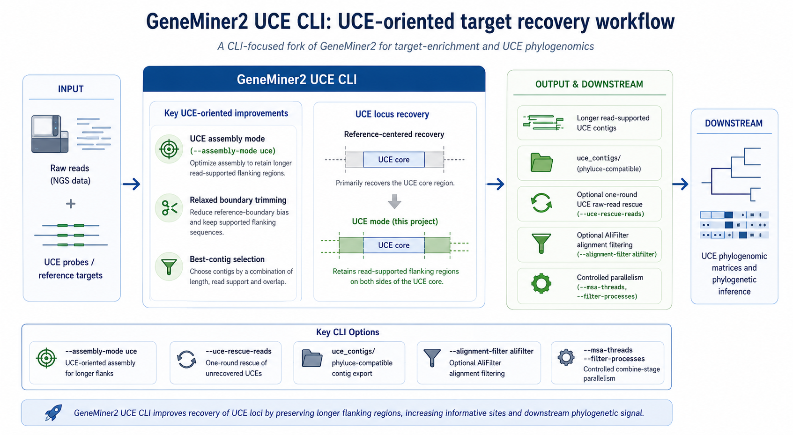

# GeneMiner2-UCE

**[中文主页](README.md)**

GeneMiner2-UCE is a command-line branch of GeneMiner2 for target-enrichment and ultraconserved element (UCE) data. It retains the original reference-guided read-recruitment and assembly framework while adapting it for short probes, flanking-sequence recovery, quality control, and phylogenetic analysis. This repository contains only the CLI source, build files, and command-line documentation; the original GUI, screenshots, and demo data are not included.

## Use and Contact

Use of this version must cite the [GeneMiner2-UCE GitHub repository](https://github.com/GUIBA-EX/GeneMiner2-UCE). A preprint describing GeneMiner2-UCE is in preparation and will be added when available. If code modifications are needed, please contact [xf@g.ecc.u-tokyo.ac.jp](mailto:xf@g.ecc.u-tokyo.ac.jp).

## Features

- Reference-guided recovery of target markers from short-read sequencing data.
- UCE assembly mode that retains read-supported flanking sequence.
- One controlled raw-read rescue round through `--uce-rescue-reads`.
- Rejection of weakly supported contigs using unique-read, positional-support, and depth metrics.
- PHYLUCE-compatible UCE exports and sample- and locus-level recovery statistics.
- Support for MAFFT, MUSCLE, Clustal Omega, trimAl, AliFilter, and several phylogenetic tree programs.



## Build

GeneMiner2-UCE is not currently distributed as a Python package that can be installed with `pip`. After installing the complete build dependencies, run the following command from the repository root:

```bash
make
```

The generated entry point is:

```bash
cli/geneminer2
```

Run `make` again after every `git pull` that updates the source. See the [command-line documentation](manual/EN_US/command_line.md) for complete build instructions and runtime dependencies.

## Quick Start

Prepare a tab-delimited sample list. Each row contains the sample name, R1, and an optional R2:

```text
Sample_A	/path/to/Sample_A_R1.fq.gz	/path/to/Sample_A_R2.fq.gz
Sample_B	/path/to/Sample_B_R1.fq.gz	/path/to/Sample_B_R2.fq.gz
```

Store each target locus in a separate FASTA file:

```text
references/
  uce-0001.fasta
  uce-0002.fasta
```

The following command runs the UCE workflow with one raw-read rescue round:

```bash
cli/geneminer2 \
  -f samples.tsv \
  -r references \
  -o output \
  --assembly-mode uce \
  --uce-rescue-reads
```

## UCE Workflow Design

### Assembly mode and candidate screening

`--assembly-mode uce` reduces the influence of short reference or probe boundaries and favors longer candidate contigs that retain read support. When no subcommands are specified, UCE mode skips reference-guided `trim` by default so newly recovered flanks are not cut back to the probe interval. Add `trim` explicitly when reference-based trimming is required.

For short UCE baits or samples that are moderately divergent from the references, consider:

```bash
--assembly-mode uce \
  -sb unlimited \
  -ka 0 \
  --min-ka 17 \
  --max-ka 31 \
  -e 1
```

These settings relax boundary control, allow automatic selection across a lower assembly k-mer range, and reduce the k-mer count threshold. They may also admit more weakly supported candidates, so the assembly summary, rescue summary, and downstream alignments should be inspected.

By default, UCE mode rejects contigs longer than 5000 bp. Contigs of at least 1000 bp must also satisfy `uniquely_placed_read_count / contig_length >= 0.003`. Multi-mapping reads remain visible in the summary but do not provide unique positional support. These thresholds can be adjusted with:

```bash
--uce-max-contig-length 5000 \
  --uce-min-read-density 0.003 \
  --uce-density-check-min-length 1000
```

The following depth-uniformity limits are disabled by default. Set them to positive values only when candidates with highly uneven depth or repeat-like depth spikes should be rejected:

```bash
--uce-max-depth-cv 0 \
  --uce-max-depth-ratio 0
```

### Reference cache

Use `--reuse-reference-cache` to reuse reference k-mer indexes across runs with the same reference directory. The cache is stored under `output/.gm2_reference_cache` by default; `--reference-cache-dir` can place it in a shared project or scratch directory.

The cache fingerprint includes reference file names, sizes, modification times, `-kf`, and `-s`. Reusing it reduces indexing time but does not alter contig selection or assembly quality. UCE rescue indexes are rebuilt per sample because their references include sample-specific first-round contigs.

### Paired-end retention and raw-read rescue

During UCE re-filtering, a paired-end read pair is retained when either mate passes the locus filter. This preserves reads overlapping the conserved UCE core together with mates that may extend into its flanks.

`--uce-rescue-reads` performs one additional recruitment round after the first assembly:

1. Combine the original locus reference with the first-round contig to build a temporary rescue reference.
2. Recruit matching reads again from the raw data.
3. Repeat re-filtering and assembly using the rescue reference.
4. Compare the first-round and rescue results and either retain or revert the rescue.

The rescue stage processes at most four samples concurrently with at most four threads per sample, scaling down automatically according to `-p` and the sample count.

If a first-round locus was accepted but its rescue result is missing or rejected, the first-round contig is restored and marked `reverted_failed_rescue`. If both results are accepted but unique-read density decreases substantially after rescue, rollback is based on:

```text
before_density = before_unique_read_count / before_contig_length
rescue_density = rescue_unique_read_count / rescue_contig_length
density_ratio = rescue_density / before_density
```

By default, `density_ratio < 0.5` restores the first-round contig and records `reverted_density_drop`. Change the threshold with `--uce-rescue-min-density-ratio`. The `after_*` fields in `uce_rescue_summary.csv` describe the attempted rescue; after rollback, the final sequence is still the first-round contig.

### Outputs and statistics

UCE mode additionally writes:

- `uce_assembly_summary.csv`: acceptance status, rejection reasons, contig length, unique positional-support extent, union-supported bases, support breadth, maximum unsupported gap, total/unique/multi-mapping reads, density, k-mer depth, candidate count, and low-quality status for every sample and locus.
- `uce_rescue_summary.csv`: before/after rescue comparisons, density ratios, rollback status, and errors.
- `uce_contigs/`: PHYLUCE-compatible contig FASTA files organized by sample.
- `contigs_all_low/`: rejected candidates retained for inspection but excluded from primary results, rescue references, combined matrices, and PHYLUCE exports.

Summarize recovery after a run with:

```bash
cli/geneminer2 stats \
  -f samples.tsv \
  -r references \
  -o output \
  --stats-no-heatmap
```

This command writes `uce_stats.tsv`, `uce_locus_stats.tsv`, `uce_seq_lengths.tsv`, `uce_read_counts.tsv`, and `uce_filtered_read_counts.tsv`. If `pandas`, `seaborn`, and `matplotlib` are available and `--stats-no-heatmap` is omitted, it also generates recovery and read-count heatmaps.

## Implementation and Downstream Tools

The secondary read filter has a Rust implementation under `rust/main_refilter_new/` with the same command-line arguments and output layout as `scripts/main_refilter_new.py`. When Cargo is available, the build uses the Rust implementation; otherwise it falls back to the Python/PyInstaller version.

Use `--msa-threads` and `--filter-processes` to control combine-stage parallelism. `--alignment-filter alifilter` selects AliFilter instead of trimAl. AliFilter is not bundled and must be installed separately with its `AliFilter` executable available in `PATH`. Omit `--alifilter-model`, or set it to `default`, to use the built-in model; provide a real `model.json` path only for a custom model.

## Documentation

- [Command-line usage](manual/EN_US/command_line.md)
- [Output files](manual/EN_US/output.md)
- [中文命令行说明](manual/ZH_CN/command_line.md)
- [中文输出文件说明](manual/ZH_CN/output.md)

## References

Primary reference for GeneMiner2:

Yu XY, Tang ZZ, Zhang Z, Song YX, He H, Shi Y, Hou JQ, Yu Y. 2026. **GeneMiner2**: Accurate and automated recovery of genes from genome-skimming data. *Molecular Ecology Resources* 26: e70111. [https://doi.org/10.1111/1755-0998.70111](https://doi.org/10.1111/1755-0998.70111)

Related earlier tools:

Zhang Z, Xie PL, Guo YL, Zhou WB, Liu EY, Yu Y. 2022. **Easy353**: A tool to get Angiosperms353 genes for phylogenomic research. *Molecular Biology and Evolution* 39(12): msac261. [https://doi.org/10.1093/molbev/msac261](https://doi.org/10.1093/molbev/msac261)

Xie PL, Guo YL, Teng Y, Zhou WB, Yu Y. 2024. **GeneMiner**: A tool for extracting phylogenetic markers from next-generation sequencing data. *Molecular Ecology Resources* 24(3): e13924. [https://doi.org/10.1111/1755-0998.13924](https://doi.org/10.1111/1755-0998.13924)

If `--alignment-filter alifilter` is used, also cite:

Bianchini G, Zhu R, Cicconardi F, Moody ERR. 2026. **AliFilter: a machine learning approach to alignment filtering.** *Molecular Biology and Evolution* 43(4): msag097. [https://doi.org/10.1093/molbev/msag097](https://doi.org/10.1093/molbev/msag097)
