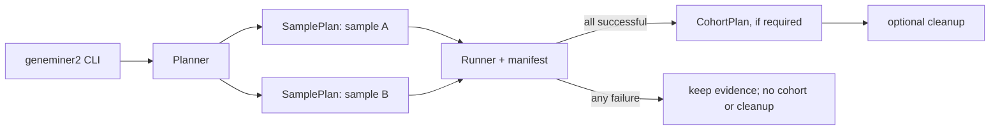

# 工作流调度架构（渐进式）

## 目标

保持现有命令、结果目录和筛选/组装语义不变，将 CLI 从“拼接命令行”收敛为一个可验证的工作流规划器。算法仍由 Rust 原生组件完成；外部程序仅作为明确的可选适配器。

不实现通用 DAG 引擎。现有工作流本质上是“每样本线性阶段 + 可选的全体收尾阶段”；以此建模更小、更容易审计，也足够表达 rescue、验证和清理。

## 唯一入口

`geneminer2` 负责解析参数、验证输入、生成计划、按样本并发执行，并在成功后运行 cohort、验证和清理。它不应理解某个组件的内部参数格式。

规划器先产生一个 `SamplePlan`（有序 `Stage` 列表），再产生零或一个 `CohortPlan`。每个阶段使用同一契约：

```text
Stage {
  id, scope(sample | cohort),
  inputs, outputs,
  component, arguments, resources,
  completion_check
}
```

阶段严格按列表顺序运行；`completion_check` 验证声明的产物是否真实存在且可读，不以进程退出码代替产物验证。只有所有样本计划成功后才执行 `CohortPlan`；失败时不产生看似完整的汇总结果。

实现时不把这些字段保留为自由字符串：`Component`、`ArtifactKind`、`Scope`、`CleanupPolicy` 使用枚举，文件位置使用 `PathBuf`，参数使用 `Vec<OsString>`。只有组件适配器可以把 `Component` 转换为 `cli/bin` 下的二进制名；因此用户参数、样本名和含空格路径不会在调度层被 shell 重新解释。

## 调用图



## 阶段产物

每个 `Stage` 只消费和产生具名的 `Artifact`，而不是约定俗成的目录：

```text
Reference | CandidateReads | FilteredReads | ContigSet
MitoEvidence | GeneCalls | RadMatrix | Report
```

组件注册表声明允许的输入/输出类型。例如 `refilter` 只能把 `CandidateReads` 变为 `FilteredReads`；`mito finalize` 必须同时得到 `ContigSet` 和同一批 `FilteredReads`。规划器在运行前检查类型和路径，杜绝把旧轮次、其他样本或错误格式的目录接入下游。

## 规范工作流

```text
original / gene
  MainFilter -> refilter -> original-rust -> gene classify/cohort

UCE（默认）
  ucefilter -> uce-rust -> 显式启用时 rescue

UCE（兼容模式）
  MainFilter -> refilter -> uce-rust -> 显式启用时 rescue

mito
  mito reference -> MainFilter -> collapse-baits -> text refilter -> uce-rust
  -> seed-contig rescue（若有）-> finalize -> circularity evidence

RAD
  probe（导入或 de novo） -> MainFilter -> refilter -> original-rust
  -> RAD finalize -> 可选 validate
```

`MainFilter + refilter` 是通用的多 bait 候选读取路径；默认 UCE 的 `ucefilter` 是其融合且面向 UCE 的替代路径。两者不可在同一计划中隐式混用。

| workflow | 工作流级阶段 | 每样本阶段 | 全体样本成功后 |
| --- | --- | --- | --- |
| original | 构建或复用 MainFilter 字典 | `MainFilter → refilter → original-rust` | 可选 consensus / trim / combine / tree |
| gene | 构建或复用 MainFilter 字典 | `MainFilter → refilter → original-rust → classify` | `gene cohort`，随后可选 resolve/tree |
| UCE 默认 | 无 | `ucefilter → uce-rust → rescue（显式启用）` | combine / tree |
| UCE 兼容 | 构建或复用 MainFilter 字典 | `MainFilter → refilter → uce-rust → rescue（显式启用）` | combine / tree |
| mito | `prepare-reference`、构建或复用字典 | `MainFilter → collapse-baits → text refilter → uce-rust → seed rescue（若有）→ finalize` | 无；每样本独立给出 circular 或保留的 linear 证据 |
| RAD | `probe`、构建或复用 MainFilter 字典 | `MainFilter → refilter → original-rust` | `rad finalize`，随后可选 validate |

## 调度边界

CLI 只选择 workflow，并交给 `Planner` 产生阶段。`Planner` 是唯一可以选择组件或构造组件参数的地方；`Runner` 只负责执行、记录和验证；领域组件只处理自己的输入。这样 `mito`、`gene`、`rad` 不再各自复制 MainFilter/refilter/assembler 的调度代码。

## 组件分层

```text
geneminer2-cli
  Planner: 选择上面的规范工作流，生成 SamplePlan + CohortPlan
  Runner: 并发、失败汇总、profile、resume、cleanup
  Registry: 组件名、能力、输入/输出契约、版本

原生组件
  MainFilterNew | main_refilter_new | uce_filter
  main_assembler-original-rust | main_assembler-rust
  mito_workflow | gene_workflow | rad_workflow | build_consensus

可选适配器
  MAFFT / IQ-TREE / ASTRAL 等；输入输出必须写入 manifest
```

第一阶段不拆分现有 crate，也不改变 `cli/bin` 布局。仅新增 `Component` 注册表和 `Stage`，使现在的 `run(binary, args)` 成为唯一的组件启动点。

## 结果状态

Runner 只使用三种终态：`succeeded`、`scientifically_incomplete`、`failed`。

- `succeeded`：组件和产物校验均通过，可供下游消费。
- `scientifically_incomplete`：程序正确完成并保存证据，但未达到工作流声明的科学判据；例如 mito 没有唯一闭环。它使 CLI 返回非零，阻止 cohort 与清理，但保留最终 linear contig、结构歧义和闭环验证报告。
- `failed`：输入、组件、I/O 或产物校验失败；下游不得消费其输出。

因此“没有闭环”永远不会被伪装成成功，也不会与 panic、磁盘写满或错误参考混为一谈。

## 产物与恢复

每个 sample 根目录写一个原子更新的 `workflow_manifest.json`；若有 cohort 阶段，则在输出根目录写一个同格式 manifest：

```text
schema_version, command, normalized_options,
reference_digest, input_digest,
stages[{id, component, state, inputs, outputs, elapsed_ms}]
```

恢复规则简单且保守：只有当 CLI schema、组件版本、规范化的语义参数、输入身份和全部声明产物一致时，阶段才跳过；否则从该阶段重跑。不能只因目标目录存在而跳过。参考与小型 bait 使用完整 SHA-256；原始 reads 默认使用绝对路径、大小和修改时间，避免为 resume 再扫描 TB 级输入。需要最强审计时以 `--strict-resume` 改用完整 SHA-256。

缓存只用于纯函数阶段：MainFilter 字典、mito bait/reference、assembler reference cache。键必须包含内容 SHA-256、关键参数、组件版本和格式版本。样本 reads 过滤结果不跨样本复用。缓存写入使用临时目录后原子改名；失败或中断留下的条目永不视为命中。

## 并发与资源

首个迁移版本保持现有 `-p` 语义：它是并行 `SamplePlan` 数，原生筛选与组装阶段仍显式使用单线程，不在阶段内部再创建第二层并发。之后才为明确支持的原生组件引入 `--stage-threads`；其值由 `ResourceRequest` 声明。全局预算满足：

```text
sum(stage.threads) <= --stage-threads
sum(stage.memory_mib) <= --memory-limit-mib（若设置）
```

这样避免当前“样本 worker × 子工具线程”造成过度订阅。输出仍为每样本独立目录，cohort 输入及所有汇总固定按 sample 名字排序，保证可复现。

## 清理

清理由 Runner 在整个计划成功后执行，而非由组件自行删除。每个 `Stage` 显式声明可清理中间产物及最后消费者；Runner 先写 `cleanup_manifest.tsv`，再逐项删除，并将成功删除的记录标为完成。最终结果、原始 reads、参考、汇总和诊断报告永不列入可清理集合。

## 迁移顺序

1. 引入 `Component`、`Stage` 与 manifest，但让它们调用现有函数；输出逐字节不变。
2. 将 UCE 默认/兼容、gene、RAD 的共同 `MainFilter -> refilter -> assembler` 计划参数化。
3. 将 mito 的 prepare/recruit/refilter/assemble/finalize 表达为同一线性阶段计划；保留它的专属停止与闭环证据。
4. 为每个计划加入“旧调度 vs 新计划”的同输入对照：过滤 FASTQ、contig、summary 和退出条件均逐项比较。
5. 对照覆盖后才删除旧的重复参数拼装函数；不迁移算法，不强制 workspace 重构。

## 不做什么

- 不引入微服务、数据库或隐式后台守护进程。
- 不把所有候选结果强制统一成一个格式。
- 不因重构修改 canonical k-mer、过滤阈值、组装选择、闭环判定或输出顺序。
- 不把 MAFFT/IQ-TREE/ASTRAL 变成运行核心的硬依赖。
